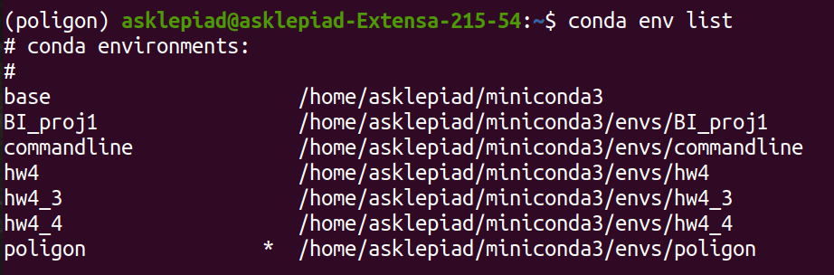
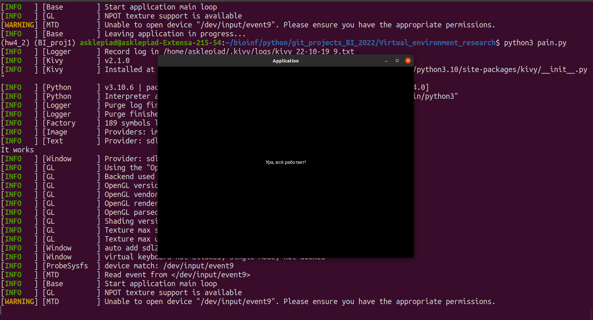

# Python_BI_2022
Repository for bioinformatics institute

## Setup of pain.py

### System properties

The script was run on the GNU Linux **Ubuntu 20.04** LTS, with **Python** version **3.10.6**
I used **pip** version **22.2.1**

### Fast description

It's important to use virtual environments when using different tools and python scripts for escaping incompatibilities.
1. In the first stage it needs to create a new conda virtual environment for the exact python version. You need to input on the command line described below script. First, it needs to check if the name of the next virtual environment has already existed.
`conda env list`

If py310 is not in the apeeared list, you may use it while creating a new virtual environment. If not, you may use another name. In this guide, I will use the "py310" name. If it has already existed, you need to use another name for the virtual environment.
`conda create -n py310 python=3.10`
You need to print "y", when programm wiil answer you about proceeding.

Then you need to activate this virtual environment, if you are now in any virtual environment, at first deactivate it with command `conda deactivate`. If not, do the next step. Print:
`conda activate py310`

If the name "py310" will appear on the left part of the command line, it's all correct.

2. On the next step you need to create pip venv (virtual environment) for using python modules and packages.
  First, you need to create a directory, where your script will be situated.
  `mkdir pain_directory`
  `cd ./pain_directory`
  
  Second, you need to create venv and activate it.
  `python3 -m venv pain`
  `source pain/bin/activate`
  
  At this stage you need to have (pain)(py310) on the left part of the command line.
  
  
 3. Next step is cloning the repository with script and requirements.txt
  `git clone <repository_url>`
  If you have problems with cloning of the repository, you always can copy and paste interesting files manually.
  
  You need to install requirements with the command:
  `pip install -r ./<directory with requirements.txt>requirements.txt`
  
  Making the file executable is realized by the next command:
  `chmod +x ./<directory with pain.py>/pain.py`
  
  Finally, you need to execute the script:
  `python3 ./<directory with pain.py>/pain.py`
  
P.S. Sometimes samurai has a target.

